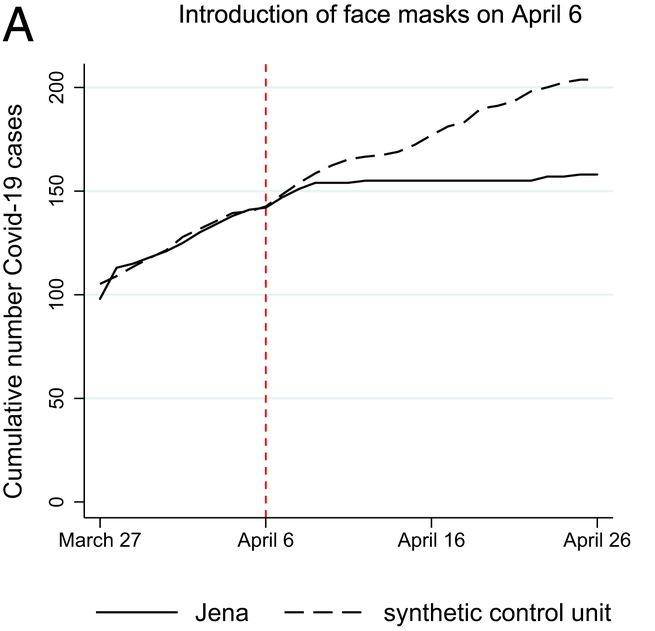

```{r setup, include=FALSE}
knitr::opts_chunk$set(echo = TRUE)
```

In this post, I have two objectives. First, I am going to walk through a basic demonstration of the synthetic control method. Second, I am going to report a simple replication of the basic results in a recently published paper, in the Proceedings of the National Academy of Sciences, namely:

- Mitze, T., Kosfeld, R., Rode, J., & Wälde, K. (2020). Face masks considerably reduce COVID-19 cases in Germany. Proceedings of the National Academy of Sciences, 117(51), 32293-32301.

## Some Intuition for Synth Control

The Synthetic Control Method (SCM for short) was introduced by Abadie, Diamond and Hainmueller, in a 2010 paper that was published in [JASA](https://amstat.tandfonline.com/doi/abs/10.1198/jasa.2009.ap08746#.YF0CFkhKj6A "JASA"). Once again, I won't rehash the details of the theory here, but I'll give you the basic idea:

As researchers, we sometimes encounter situations that can loosely be characterized as follows: 1) We have 1 (or very few) treated panels; 2) Despite having numerous untreated panels, that have the potential to act as control / counterfactual, none of them are immediately useful, because they exhibit markedly different pre-trends; 3) Whatever transformations you implement, or controls you condition upon, you are unable to resolve the problem.  

One possible solution we might jump to is matching. However, perhaps you simply cannot identify reliable / quality matches for the treatment in your data. An alternative approach is to try reweighting the available observations. This, essentially, is what SCM implements. It identifies a linear, weighted combination of control unit outcomes that maps control unit outcomes to those observed for the treated unit, when the treatment is not active (i.e., in the pre-treatment period). 

There are other ways we can think about what SCM try to accomplish, which may be more intuitive for some. Most simply, we can think about this "mapping" excercise as a prediction problem. Viewed this way, difference-in-differences is just a relatively inflexible approach for learning that relationship (i.e., it's a shitty prediction algorithm). This means that a parallel trend violation basically implies that difference-in-differences is not a suitable way of representing the mapping we care about. We sometimes try to make diff-in-diff more flexible by transforming the dependent variable (e.g., the log), accommodating differential trends, or conditioning on other time-varying covariates. However, whatever we do, sometimes those approaches just aren't flexible enough. What SCM does is allow for greater flexibility (i.e., its a somewhat better prediction method). It accomplishes this by allowing for a fractional representation of individual panels when it learns the mapping. 

Assuming we can learn how to use the control panels' outcomes to predict the treatment panel outcome before treatment turns on, we can apply that learned predcition into the post period, to predict what *would* have happened to the treatment outcome, had the treatment never been turned on (or so the logic goes). Not that this is basically the exact same logic we apply with diff-in-diff; we are assuming that the control panel outcomes, plus covariates, plus panel fixed effects and time period fixed effects, suck out all the variation (aside from treatment) that drives differences between our treatment and control groups. Anything that is left over when we remove those pieces has to be attributable to the treatment turning on. 

I am sure there are some nuances here that my explanation above glosses over (e.g., the weights we learn under SCM are constrained to be non-negative, for example), so I encourage you to go read the original paper, as well as subsequent innovations, e.g., [synthetic difference in differences](https://www.nber.org/papers/w25532 "synthetic difference in differences"), [generalized synthetic control](https://www.cambridge.org/core/journals/political-analysis/article/generalized-synthetic-control-method-causal-inference-with-interactive-fixed-effects-models/B63A8BD7C239DD4141C67DA10CD0E4F3 "generalized synthetic control") and synthetic control using LASSO, or [SCUL](https://hollina.github.io/scul/ "SCUL"). 

What I am going to do here is provide a quick demonstration of the method, via a replication of some recently published work. At the same time, I'll demonstrate the SCM-using-LASSO variant as well, to demonstrate its value in this situation, where the number of available controls is quite large.

## Replicating Mitze et al (2020, PNAS)

Mitzen et al. (2020, PNAS) examine a case study in Germany around the mandatory imposition of facemasks in Jena, Germany, on April 6th of 2020. They employed this policy event as something of a natural experiment, to estimate the effect of mandatory facemask policies on COVID-19 case rates. Interestingly, this setup is also something of an ideal use case for SCM; we have a single treated location (the unit of analysis here is a district), and many controls (hundreds of other, untreated districts, in fact). Below is the main result of the study, a figure, which depicts the actual cumulative covid case series in Jena (solid line), and the estimated synthetic counterfactual (dashed line). This is the result we are going to try to reproduce. 

{width=50%}

# Data / Measures

Now, I originally sought to replicate this study becasue I needed a teaching example for my graduate-level causal inference course. The study seemed like a wonderful candidate for replication, because PNAS requires authors to disclose data and analysis scripts as supplementary appendices. Unfortunately, in this case, I was unable to locate anything approximating useful replication materials. The supplementary appendix did not include any analysis scripts (despite the authors' claim to the contrary in their paper), and the `data' that was provided amounted to a single spreadsheet, with a handful of time series (certainly not the entirety of raw data that was used to construct a synthetic control). Rather than give up, I decided to locate the datasets the authors had claimed to have used in their study. After some digging, I was able to locate most of the relevant data. 

Data on daily COVID-19 case reports for each German district and day have been published by the Robert Koch Institute since January of 2020. They have been made available publicly, via API. Fortunately, someone has been collecting that data and sharing it on a GitHub repository! See [here.](https://github.com/averissimo/covid19.de.data/ "here.")

I was then able to locate data for most of the control covariates the authors mentioned in their paper, by scouring different German Census Data portals (not a fun exercise when you cannot speak German!). In particular, I located data on the number of physicians per capita in each district, number of pharmacies, number of hospital beds, as well as demographics on resident volumes by age category, gender and so on, from two sources. 

Many, if not most of the covariates are available from the Germany Census data portal [DEStatis](https://www.destatis.de/EN/Themes/Countries-Regions/Regional-Statistics/_node.html "DEStatis"), including population counts by age range, as well as by gender. Further, data on a region’s local healthcare infrastructure, including physicians per capita, hospital beds, and number of pharmacies are available on an annual basis in the [INKAR database](https://www.inkar.de/ "INKAR database"), maintained by the German Federal Institute for Research on Building, Urban Affairs and Spatial Development (be prepared to use Google Translate if you don't speak German!). I obtained the most recently available published values for each district, but I want to note that, using SCUL, which is more flexible than standard SCM, we will not need these additional covariates to do a good job.)

# Data Import & Integration

I am going to import and integrate the COVID-19 daily cumulative case volumes, district names (for labels / interpretation), and a few of the district characteristics, namely physicians per capita, pharmacy volumes, and count of individuals by age range. Again, I will ultimately use the latter in my SCM implementation to arrive at a result that looks rather similar to that published in the paper. However, using SCUL, as you will see, we can do a good job without those features.

Let's import and integrate the data... 

```{r libs_setup,message=FALSE,warning=FALSE}
library(tidyr)
library(broom)
library(dplyr)
library(ggplot2)
library(glmnet) # I'm going to use this for LASSO to select control panels.
library(janitor) # I will use this to clear some missing values.
library(Synth) # This is the original SCM package implemented by Diamond. 
library(ggthemes)
library(patchwork)
library(tmap)

### Let's import Covid-19 case volume data from german districts, by day..
setwd("/Users/gburtch/Google Drive/Teaching/Courses/MSBA 6440/2021/(9) Synthetic Control /Covid-19 Facemasks/")
covid <- read.csv("Covid_DE_cases_by_district.csv")
dist_names <- read.csv("Covid_DE_district_IDs.csv")
covid <- covid %>% merge(dist_names, by.x = "dist_id", by.y = "id")

# Let's convert date column into date format. 
covid$date <- as.Date(covid$date)
covid <- covid[order(covid$dist_id,covid$date),]

# We can pull in other features, though these are not actually required. 
# E.g., we can pull in physicians per capita in each district. 
setwd("/Users/gburtch/Google Drive/Teaching/Courses/MSBA 6440/2021/(9) Synthetic Control /Covid-19 Facemasks/district_demographics/")
dist_physicians <- read.csv("dist_phys_pcap.csv",sep=";") %>% rename("dist_id" = "Kennziffer", "physicians" = "Ärzte.je..Einwohner") %>% filter(!is.na(dist_id)) %>% select(c(dist_id,physicians))
dist_physicians$physicians <- as.numeric(gsub(",",".",dist_physicians$physicians))
covid <- covid %>% merge(dist_physicians, by="dist_id", all.x=TRUE)

# We now pull in pharmacy information.
dist_pharma <- read.csv("dist_pharmas_2017.csv",sep=";") %>% filter(!is.na(Kennziffer)) %>% rename("dist_id" = "Kennziffer","pharmacies" = "Apotheken")
dist_pharma$pharmacies <- as.numeric(gsub(",",".",dist_pharma$pharmacies))
dist_pharma <- dist_pharma %>% select(c(dist_id,pharmacies))
covid <- covid %>% merge(dist_pharma, by="dist_id",all.x=TRUE)

# We can pull in population information by age, and so on now as well.
dist_pop <- read.csv("dist_pop_age.csv", sep=";") %>% select(-c(dist_name))
dist_pop$year <- substr(dist_pop$year,1,4) 
# Some missing values here.
dist_pop <- dist_pop %>% lapply(as.integer) %>% as.data.frame()
# We have yearly values for 3 years - let's just use the most recent set of values in 2019.
dist_pop <- dist_pop %>% filter(year==2019) %>% select(-c(year))
covid <- covid %>% merge(dist_pop, by="dist_id", all.x=TRUE)

# Jena is district id 16053. 
covid$treat <- covid$dist_id==16053

# Let's trim to a reasonable window around the event date. 
covid <- subset(covid,date > as.numeric(as.Date("2020-03-01")) & date <= as.numeric(as.Date("2020-05-21")))
```

Now that we've imported and integrated the data, we can visualize the cumulative COVID case series for all the districts, to see what was going on in early 2020. I'm going to plot the log of each series. Note that the case volumes are very right-skewed, so if we plot the levels over time we have a very hard time seeing what was going on in most of the (smaller) districts, as the big districts expand the range of the y-axis and compress the small locations together at the bottom of the plot. 

``` {r, Visualizing the Series, message=FALSE,error=FALSE,warning=FALSE}
# Hard to see much here in the descriptive plot of the time series.
# Jena is there at the bottom, though hard to see. 
ggplot(data=covid,aes(x=date,y=log(cum_cases+1),color=factor(treat),group=dist_id,alpha=treat)) +
  geom_line() +
  geom_vline(xintercept=as.numeric(as.Date("2020-04-06")),color="red") + 
  xlab(expression(bold(paste("Date (2020)")))) +  
  ylab(expression(bold(paste("Logarithm of Cases")))) + 
  scale_alpha_manual(guide=FALSE,values=c(0.25,1))+
  scale_color_manual(name="District",labels=c("Others", "Jena"),values=c("gray","blue"))+
  ggtitle("Cumulative COVID-19 Cases Over Time") +
  theme_economist() +
  #Comment the below line out if you don't have Economica fonts installed.
  theme(text = element_text(family = "Economica", size = 10), axis.title.y = element_text(margin = margin(t = 0, r = 10, b = 0, l = 0)),axis.title.x = element_text(margin = margin(t = 10, r = 0, b = 0, l = 0)))+
  NULL
```

We can see the treated district, Jena, in blue, right in the middle. 


We can also visualize these locations, so we have a sense of where Jena is, and its spatial neighbors, which we may ultimately be worried about excluding, to avoid SUTVA violations.

```{r, geo_plot,error=FALSE,warning=FALSE,message=FALSE}
# We can quickly plot where Jena is located within its state in Germany.
DE_Districts <- readRDS(url("https://biogeo.ucdavis.edu/data/gadm3.6/Rsf/gadm36_DEU_3_sf.rds"))
DE_Districts$isJena <- ifelse(DE_Districts$NAME_2=="Jena", "blue", "lightblue")
ggplot(data=DE_Districts %>% filter(NAME_1=="Thüringen")) + geom_sf(aes(fill = isJena),alpha=0.5) + scale_fill_manual(guide=FALSE,values=c("blue","lightblue"))
```


# Synthetic Control Using LASSO (SCUL)

I'm going to start of implementing a synthetic control estimate employing a cross-validated LASSO to identify the best set of control districts and their associated weights that minimize prediction error for the treated panel's covid numbers in the pre-treatment period. After I do this, I'll pivot to the traditioanl SCM using the Synth package (hold tight).

The first thing we need to do is to pivot the panel from long format to wide format. This is because we need the control panels' covid case time series to appear as columns (features) that can be used to predict the time series in Jena. 

```{r, pivot_wide, message=FALSE, error=FALSE, warning=FALSE}

# I'm demonstrating syntax here for the pivot_wider function. After I transform the data like this, observations are uniquely identified by the date variable (rather than district-date).
covid.wide <- covid %>% pivot_wider(id_cols=c("date"),names_from=c("district"),values_from=c("cum_cases","under.3.years","yr.3.to.under.6.years"))

# I'm also going to then pull out pre-treatment observations, which we will use to 'train' the model that will yield the synthetic control for Jena.
covid.wide.train <- subset(covid.wide,date<as.numeric(as.Date("2020-04-06")))
```

Now, I'm going to use a 5-fold cross validated LASSO to identify the control district time series that are 'useful' for predicting the treatment outcome. LASSO is useful here because we have something of a curse of dimensionality problem. This is because we have ~400 predictors, but just 35 observations!

```{r, LASSO,error=FALSE,message=FALSE,warning=FALSE}
# We have many more predictors than time periods now, so we let's do some feature selection.
# I'm going ot use LASSO to pick the controls I'll work with. 
covid.wide.train.lasso <- remove_empty(covid.wide.train, which=c("rows","cols"))
covid.wide.train_mm <- model.matrix(`cum_cases_ SK Jena`~.,covid.wide.train.lasso)
lasso <- cv.glmnet(covid.wide.train_mm, covid.wide.train$`cum_cases_ SK Jena`, standardize=TRUE,alpha=1,nfolds=5)
ests <- as.matrix(coef(lasso,lasso$lambda.1se))

# Here are the non-zero control panels that lasso selected.
names(ests[ests!=0,])
```

Of course, we could run predictions right off the resulting LASSO model, but I'm going to just quickly use the selected controls in a simple linear model to generate these predictions (it's faster / easier syntax wise).

```{r, SCUL_Predictions,message=FALSE,error=FALSE,warning=FALSE}
# Okay, let's build our 'synthetic control'. 
fml.rhs <- paste(c(names(ests[ests!=0,]))[2:length(names(ests[ests!=0,]))],collapse="+")
fml <- as.formula(paste("`cum_cases_ SK Jena`~",fml.rhs))
synth <- lm(data=covid.wide.train,formula=fml)

# Now we can synthesize the control series in the original data, into the post period. 
covid.wide$synth <- predict(synth,newdata = covid.wide)

# Now we can visualize the result.
OLS_plot <- ggplot(data=covid.wide,aes(y=synth,x=date,linetype="dashed")) + geom_line() + 
  geom_line(aes(y=`cum_cases_ SK Jena`,x=date,linetype="solid")) +
  geom_vline(xintercept=as.numeric(as.Date("2020-04-06")),color="red") + 
  xlab(expression(bold(paste("Date (2020)")))) +  
  ylab(expression(bold(paste("Cumulative COVID-19 Cases")))) + 
  scale_linetype_manual(name="Series",values=c("dashed","solid"),labels=c("Synth","Jena, DE"))+
  ggtitle("Effect of Masks on COVID-19 (LASSO -> OLS Synth)") +
  theme_economist() +
  #Comment the below line out if you don't have Economica fonts installed.
  theme(text = element_text(family = "Economica", size = 10), axis.title.y = element_text(margin = margin(t = 0, r = 10, b = 0, l = 0)),axis.title.x = element_text(margin = margin(t = 10, r = 0, b = 0, l = 0)))+
  xlim(as.Date("2020-03-27"),as.Date("2020-04-26")) +
  ylim(0,225)+
  NULL

# Let's see how we did.
OLS_plot
```

If we compare the resulting plot against the original from the manuscript, we see that the two are virtually identical! Okay, let's do this again, using the Synth package. 

# Vanilla Synthetic Control

With the Synth package, we don't need to manually pivot the data and implement the prediction step. Instead, we employ the provided data preparation function, Synth::dataprep(). That said, there are a few things we need to do here for the Synth package to run; it seems the outcome variable name creates problems, so we rename it to `Y'. We also need to provide a numeric date variable.

```{r, VanillaSCM, message=FALSE,warning=FALSE,error=FALSE}
# That was quick and dirty, so let's do this properly now. 
# We can implement SCM properly using the Synth package.
# This package will implement appropriate non-negativity constraints on the control weights.
# This package will also minimize MSPE (whereas a simple OLS minimizes SSE)

# The outcome variable renamed to Y as Synth isn't liking the original variable name.
covid <- covid %>% rename(Y = cum_cases)

# Let's also eliminate missing values.
covid <- subset(covid,complete.cases(covid))

# Synth requires numeric date and unit ID variables.
covid$date2 <- as.numeric(covid$date)

# Synth requires a list of control ID's - let's pull them out here.
# Note: 16053 is Jena.
# The authors also omitted a few neighboring districts, and districts that instituted their own mask policies soon after Jena. 
# We thus also exclude 16071; Weimarer Land, 16062; Nordhausen, and 8325; Rottweil.
# The authors also omitted Saale-Holzland, but we lose it due to missing data on district features anyway.
dist_ids <- unique(covid$dist_id)
control_ids <- dist_ids[dist_ids != 16053 & dist_ids != 16071 & dist_ids != 16062 & dist_ids != 8325]

# Now we use Synth's data preparation package. 
dataprep.out=
  dataprep(foo = covid,
           dependent = "Y",
           unit.variable = "dist_id",
           time.variable = "date2",
           
           # The authors used a lot of seemingly irrelevant predictors
           # For example, average female age? Average male age? Why is gender important?
           # I am going to keep things simple here: pharmacies, physicians and elderly.
           predictors = c("pharmacies","physicians","yr.75.years.and.over"),
           predictors.op = "mean",
           
           # We can also predict using case volumes day before treatment and week before treatment.
           special.predictors = list(list("Y", 18356, "mean"),list("Y", 18350, "mean")),
           
           #which panel is treated?
           treatment.identifier = 16053,
           
           #which panels are we using to construct the synthetic control?
           # Controls here will be every other district.
           controls.identifier = control_ids,
           
           #what is the pre-treatment time period?
           #these numeric values correspond to 34 days before treatment.
           #the paper only uses the 14 days before treatment for some reason?
           time.predictors.prior = c(18323:18357),
           
           time.optimize.ssr = c(18323:18357),
           
           #name of panel units
           unit.names.variable = "district",
           
           #time period to generate the plot for.
           #paper only goes 20 days post treatment because other treatments started.
           #We will just see what this looks like, however. 
           time.plot = 18343:18403)

# Note that this will take a few minutes to run. 
synth.out = synth(dataprep.out)
```

We can then use the native plotting functions from Synth to visualize the result, as follows. These plots rely on the base plotting tools in R. Again, the result is essentially the same, except that now we get a weaker treatment effect. I should note here that when I omitted the additional predictor covariates in my first pass at this, and the resulting synthetic control looked quite poor in the pre period. I then explored the inclusion of additional covariate predictors in something of a trial-and-error manner to arrive at this result. 

```{r, native_plots, message=FALSE,error=FALSE,warning=FALSE}
# Path.plot() plots the synthetic against the actual treated unit data. 
path.plot(dataprep.res = dataprep.out, synth.res = synth.out,Xlab="Date",Ylab="Cumulative COVID-19 Cases",Main="Comparison of Synth vs. Actual Cum. COVID-19 Cases in Jena, Germany")

# And we can add a vertical line where the treatment occurred.
abline(v=18358,lty=2,col="red")
```

Alternatively, we can pull out the results and generate our own, prettier plots, as follows.

```{r, better_synth_plot, message=FALSE,warning=FALSE,error=FALSE}
# Let's pull out the data from the result, to make our own nicer plots in ggplot of course
synth_data_out = data.frame(dataprep.out$Y0plot%*%synth.out$solution.w) 
date = as.numeric(row.names(synth_data_out))
plot.df = data.frame(y=covid$Y[covid$dist_id==16053 & covid$date2 %in% date])
plot.df$synth = synth_data_out$w.weight
plot.df$date <- covid$date[covid$dist_id==16053 & covid$date2 %in% date]
SCM_plot <- ggplot(plot.df,aes(y=y,x=date,linetype="solid")) + geom_line() + 
  geom_line(aes(y=synth,x=date,linetype="dashed")) +
  geom_vline(xintercept=18358,color="red") + 
  xlab(expression(bold(paste("Date (2020)")))) +  
  ylab(expression(bold(paste("Cumulative COVID-19 Cases")))) + 
  scale_linetype_manual(name="Series",values=c("dashed","solid"),labels=c("Synth","Jena, DE"))+
  ggtitle("Effect of Masks on COVID-19 (Proper Synth)") +
  theme_economist() +
  #Comment the below line out if you don't have Economica fonts installed.
  theme(text = element_text(family = "Economica", size = 10), axis.title.y = element_text(margin = margin(t = 0, r = 10, b = 0, l = 0)),axis.title.x = element_text(margin = margin(t = 10, r = 0, b = 0, l = 0)))+
  ylim(0,225)+
  NULL

# Let's put the two plots side-by-side.
SCM_plot
```

