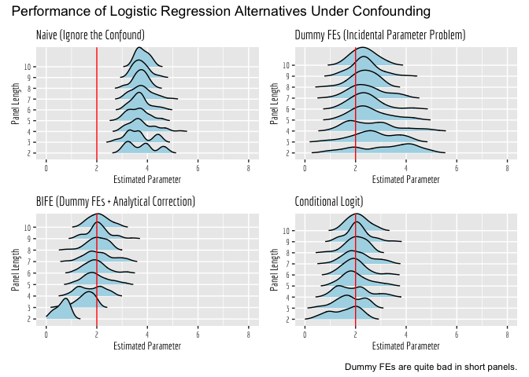

logit-ipp
================
2021-03-6

This is the first in what I hope will be a series of basic blog posts in
which I’ll discuss basic issues in econometric analysis, and common
pitfalls. My plan is to demonstrate the issues intuitively, and
concretely, via simulation. Hopefully by providing this code, anyone who
comes across the material can download and play with the code themselves
to better understand the issues at play. All simulations will be
conducted in R.

## Incidental Parameters Problem

The incidental parameters problem (henceforth IPP) is a well-known
problem in econometrics, dating back more than 80 years. The seminal
paper introducing the problem was published by Jerzy Neyman and Betty
Scott in
[Econometrica](https://www.jstor.org/stable/1914288?seq=1 "Econometrica")
in 1948. I won’t rehash the details of the issue here, but I’ll give you
the punch line.

1.  With linear regression, we generally address time invariant
    confounds in panel data via fixed effects (either panel dummies, or
    the mathematically equivalent within-transformation).

2.  Unfortunately, those methods do not ‘work’ in non-linear regression,
    because the fixed effects enter the specification multiplicatively
    (the only exception here is Poisson regression, where the math still
    works out as a matter of convenience).

3.  Fortunately, Gary Chamberlain derived [conditional
    logit](https://www.jstor.org/stable/2297110?seq=1 "conditional logit"),
    wherein the panel fixed effects are instead addressed via a
    transformation to the likelihood function.

While I encourage anyone to go and read these papers, my goal here is to
demonstrate concretely, via simulation, just how poorly a dummy fixed
effect estimator performs in the case of panel logistic regression. I
will first simulate a simple scenario of static confounding, wherein a
standard logistic regression model fails to recover the parameter of
interest. Subsequently, I will compare its performance against
alternative correction procedures, namely i) a dummy fixed effect
estimator and ii) the Chamberlain conditional logit estimator. Notably a
more recent literature pursues bias correction methods for general
non-linear panel data models, e.g., Fernandez-Val (2009) in the [Journal
of
Econometrics](https://www.sciencedirect.com/science/article/pii/S0304407609000463 "Journal of Econometrics").
Accordingly, iii) I will also explore the efficacy of Fernandez-Val’s
bias correction following dummy fixed effect logit.

``` r
library(dplyr)
```

    ## 
    ## Attaching package: 'dplyr'

    ## The following objects are masked from 'package:stats':
    ## 
    ##     filter, lag

    ## The following objects are masked from 'package:base':
    ## 
    ##     intersect, setdiff, setequal, union

``` r
library(splitstackshape)
library(stargazer)
```

    ## 
    ## Please cite as:

    ##  Hlavac, Marek (2018). stargazer: Well-Formatted Regression and Summary Statistics Tables.

    ##  R package version 5.2.2. https://CRAN.R-project.org/package=stargazer

``` r
library(ggplot2)
library(survival)
library(patchwork)
library(bife)
library(ggthemes)
library(ggridges)
library(panelView)
library(boot)
```

    ## 
    ## Attaching package: 'boot'

    ## The following object is masked from 'package:survival':
    ## 
    ##     aml

``` r
library(modelsummary)
```

``` r
# We begin by setting some simulation parameters.
# Note: Try blowing up the size of the data to, say, 5000 subjects, and 10 observations each, to see what happens to LSDV later... R may crash though.
set.seed(1020)
n <- 100
sims <- 50
panel_max <- 10

sim_result <- expand.grid(periods = seq(from=2,to=panel_max,by=1),run = seq(sims))

# make static features.
confound <- rnorm(n, mean = 0, sd=1)
id <- seq(n)
treatment_grp <- rbinom(n=n, size=1, prob=confound > median(confound))
df <- data.frame(confound=confound,id = id, treatment_grp = treatment_grp)

# Let's do 100 runs each, using panels lengths between 2 and 50 periods.
# We will compare four logistic regressions - a control model, a naive model, a clogit model, a dummy FE model, and bife.
for (r in 1:sims){
  for (p in seq(from=2,to=panel_max,by=1)){
    
      # Simulate a panel of p periods.
      # Make the data with whole panel length
      df_tmp <- expandRows(df, count=p, count.is.col=FALSE)
      
      # Treatment begins midway through the panel for treated units.
      df_tmp <- df_tmp %>% group_by(id) %>% mutate(period = seq(from=1,to=p,by=1)) %>% mutate(Treat = (period > floor((p+1)/2))*treatment_grp) %>% arrange(treatment_grp,id,period) %>% select(-c(treatment_grp))
      df_tmp$Treat_center <- df_tmp$Treat - mean(df_tmp$Treat)
      df_tmp$xb <- 2*df_tmp$Treat_center + 4*df_tmp$confound
      df_tmp$p <- inv.logit(df_tmp$xb)
      df_tmp$Y <- rbinom(nrow(df_tmp),size=1, prob=df_tmp$p)
      
      #panelView(df_tmp,D="Treat",index=c("id","period"))
      
      # Let's make sure our treatment variable is correlated with the confounder now.
      cor(df_tmp$Treat,df_tmp$confound)
    
      # Estimate our four logit models.
      logit_mod_control <- glm(data=df_tmp,Y ~ Treat_center + confound, family = "binomial")
      logit_mod_omit <- glm(data=df_tmp,Y ~ Treat_center, family = "binomial")
      logit_mod_fe <- clogit(data=df_tmp,Y ~ Treat_center + strata(id))
      logit_mod_ipp <- glm(data=df_tmp,Y ~ Treat_center + factor(id), family = "binomial")
      logit_mod_bife <- bias_corr(bife(Y~Treat_center | id,data=df_tmp))
      
      sim_result_row <- data.frame(cbind(periods=p,run=r,b_control=logit_mod_control$coefficients[2],b_omit=logit_mod_omit$coefficients[2],b_fe=logit_mod_fe$coefficients[1],b_ipp=logit_mod_ipp$coefficients[2],b_bife=logit_mod_bife$coefficients[1]))
      
      # Reset these objects to NA in case we get no convergence on any of them in next loop. 
      logit_mod_control <- NA
      logit_mod_omit <- NA
      logit_mod_fe <- NA
      logit_mod_ipp <- NA
      logit_mod_bife <- NA
      
      sim_result <- sim_result %>% left_join(sim_result_row,by=c("periods","run"))
      sim_result$b_control.y[is.na(sim_result$b_control.y) ] <- sim_result$b_control.x[ is.na(sim_result$b_control.y)]
      sim_result$b_omit.y[is.na(sim_result$b_omit.y) ] <- sim_result$b_omit.x[ is.na(sim_result$b_omit.y)]
      sim_result$b_fe.y[is.na(sim_result$b_fe.y) ] <- sim_result$b_fe.x[ is.na(sim_result$b_fe.y)]
      sim_result$b_ipp.y[is.na(sim_result$b_ipp.y) ] <- sim_result$b_ipp.x[ is.na(sim_result$b_ipp.y)]
      sim_result$b_bife.y[is.na(sim_result$b_bife.y) ] <- sim_result$b_bife.x[ is.na(sim_result$b_bife.y)]
      
      if("b_control.y" %in% colnames(sim_result)){
        sim_result <- sim_result %>% select(-c(b_control.x, b_omit.x, b_fe.x, b_ipp.x,b_bife.x)) %>% rename(b_control=b_control.y, b_omit = b_omit.y, b_fe = b_fe.y, b_ipp = b_ipp.y, b_bife = b_bife.y)
      }
   }
}
```

    ## Warning in fitter(X, Y, istrat, offset, init, control, weights = weights, :
    ## Loglik converged before variable 1 ; beta may be infinite.

    ## Warning: glm.fit: fitted probabilities numerically 0 or 1 occurred

    ## Warning in fitter(X, Y, istrat, offset, init, control, weights = weights, :
    ## Loglik converged before variable 1 ; beta may be infinite.

    ## Warning: glm.fit: fitted probabilities numerically 0 or 1 occurred

    ## Warning in fitter(X, Y, istrat, offset, init, control, weights = weights, : Ran
    ## out of iterations and did not converge

    ## Warning: glm.fit: fitted probabilities numerically 0 or 1 occurred

    ## Warning in fitter(X, Y, istrat, offset, init, control, weights = weights, :
    ## Loglik converged before variable 1 ; beta may be infinite.

    ## Warning: glm.fit: fitted probabilities numerically 0 or 1 occurred

    ## Warning in fitter(X, Y, istrat, offset, init, control, weights = weights, : Ran
    ## out of iterations and did not converge

    ## Warning: glm.fit: fitted probabilities numerically 0 or 1 occurred

    ## Warning in fitter(X, Y, istrat, offset, init, control, weights = weights, :
    ## Loglik converged before variable 1 ; beta may be infinite.

    ## Warning: glm.fit: fitted probabilities numerically 0 or 1 occurred

    ## Warning in fitter(X, Y, istrat, offset, init, control, weights = weights, : Ran
    ## out of iterations and did not converge

    ## Warning: glm.fit: fitted probabilities numerically 0 or 1 occurred

    ## Warning in fitter(X, Y, istrat, offset, init, control, weights = weights, : Ran
    ## out of iterations and did not converge

    ## Warning: glm.fit: fitted probabilities numerically 0 or 1 occurred

    ## Warning in fitter(X, Y, istrat, offset, init, control, weights = weights, : Ran
    ## out of iterations and did not converge

    ## Warning: glm.fit: fitted probabilities numerically 0 or 1 occurred

    ## Warning in fitter(X, Y, istrat, offset, init, control, weights = weights, :
    ## Loglik converged before variable 1 ; beta may be infinite.

    ## Warning: glm.fit: fitted probabilities numerically 0 or 1 occurred

    ## Warning in fitter(X, Y, istrat, offset, init, control, weights = weights, :
    ## Loglik converged before variable 1 ; beta may be infinite.

    ## Warning: glm.fit: fitted probabilities numerically 0 or 1 occurred

    ## Warning in fitter(X, Y, istrat, offset, init, control, weights = weights, : Ran
    ## out of iterations and did not converge

    ## Warning: glm.fit: fitted probabilities numerically 0 or 1 occurred

    ## Warning in fitter(X, Y, istrat, offset, init, control, weights = weights, :
    ## Loglik converged before variable 1 ; beta may be infinite.

    ## Warning: glm.fit: fitted probabilities numerically 0 or 1 occurred

    ## Warning in fitter(X, Y, istrat, offset, init, control, weights = weights, : Ran
    ## out of iterations and did not converge

    ## Warning: glm.fit: fitted probabilities numerically 0 or 1 occurred

    ## Warning in fitter(X, Y, istrat, offset, init, control, weights = weights, : Ran
    ## out of iterations and did not converge

    ## Warning: glm.fit: fitted probabilities numerically 0 or 1 occurred

    ## Warning in fitter(X, Y, istrat, offset, init, control, weights = weights, :
    ## Loglik converged before variable 1 ; beta may be infinite.

    ## Warning: glm.fit: fitted probabilities numerically 0 or 1 occurred

    ## Warning in fitter(X, Y, istrat, offset, init, control, weights = weights, :
    ## Loglik converged before variable 1 ; beta may be infinite.

    ## Warning: glm.fit: fitted probabilities numerically 0 or 1 occurred

    ## Warning in fitter(X, Y, istrat, offset, init, control, weights = weights, : Ran
    ## out of iterations and did not converge

    ## Warning: glm.fit: fitted probabilities numerically 0 or 1 occurred

    ## Warning in fitter(X, Y, istrat, offset, init, control, weights = weights, :
    ## Loglik converged before variable 1 ; beta may be infinite.

    ## Warning: glm.fit: fitted probabilities numerically 0 or 1 occurred

    ## Warning in fitter(X, Y, istrat, offset, init, control, weights = weights, : Ran
    ## out of iterations and did not converge

    ## Warning: glm.fit: fitted probabilities numerically 0 or 1 occurred

    ## Warning in fitter(X, Y, istrat, offset, init, control, weights = weights, :
    ## Loglik converged before variable 1 ; beta may be infinite.

    ## Warning: glm.fit: fitted probabilities numerically 0 or 1 occurred

    ## Warning in fitter(X, Y, istrat, offset, init, control, weights = weights, : Ran
    ## out of iterations and did not converge

    ## Warning: glm.fit: fitted probabilities numerically 0 or 1 occurred

    ## Warning in fitter(X, Y, istrat, offset, init, control, weights = weights, : Ran
    ## out of iterations and did not converge

    ## Warning: glm.fit: fitted probabilities numerically 0 or 1 occurred

    ## Warning in fitter(X, Y, istrat, offset, init, control, weights = weights, : Ran
    ## out of iterations and did not converge

    ## Warning: glm.fit: fitted probabilities numerically 0 or 1 occurred

    ## Warning in fitter(X, Y, istrat, offset, init, control, weights = weights, :
    ## Loglik converged before variable 1 ; beta may be infinite.

    ## Warning: glm.fit: fitted probabilities numerically 0 or 1 occurred

    ## Warning in fitter(X, Y, istrat, offset, init, control, weights = weights, : Ran
    ## out of iterations and did not converge

    ## Warning: glm.fit: fitted probabilities numerically 0 or 1 occurred

    ## Warning in fitter(X, Y, istrat, offset, init, control, weights = weights, :
    ## Loglik converged before variable 1 ; beta may be infinite.

    ## Warning: glm.fit: fitted probabilities numerically 0 or 1 occurred

    ## Warning in fitter(X, Y, istrat, offset, init, control, weights = weights, : Ran
    ## out of iterations and did not converge

    ## Warning: glm.fit: fitted probabilities numerically 0 or 1 occurred

    ## Warning in fitter(X, Y, istrat, offset, init, control, weights = weights, : Ran
    ## out of iterations and did not converge

    ## Warning: glm.fit: fitted probabilities numerically 0 or 1 occurred

# Finally, our visuals of the results…

    ## Picking joint bandwidth of 0.154

    ## Warning: Removed 6 rows containing non-finite values (stat_density_ridges).

    ## Picking joint bandwidth of 0.287

    ## Warning: Removed 29 rows containing non-finite values (stat_density_ridges).

    ## Picking joint bandwidth of 0.165

    ## Warning: Removed 35 rows containing non-finite values (stat_density_ridges).

    ## Picking joint bandwidth of 0.2

    ## Warning: Removed 29 rows containing non-finite values (stat_density_ridges).

<!-- -->
